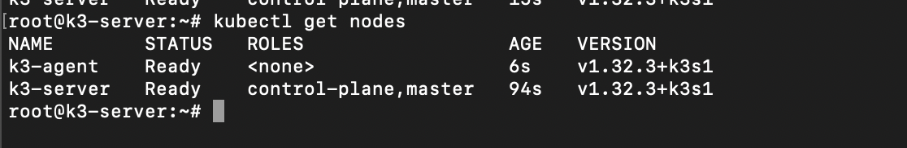

# k3-cluster


# Introduction

This project demonstrates setting up a lightweight Kubernetes (k3s) cluster using virtual machines. It includes one **server node**, one **agent node**, and a simple app deployment to verify the setup.

---

## 📌 Objective

- Install and configure a k3s cluster (1 server, 1 agent)
- Validate the cluster with `kubectl`
- Deploy a test app with 2 replicas
- Provide configurations files and screenshots for progress tracking


---

# 🔧 Prerequisites

Before you begin, please review the [installation requirements (https://docs.k3s.io/quick-start). 


---

## ⚡ Quick Start

Follow these steps to get your Kubernetes cluster up and running:

### 1. Install k3s on the Server Node
Install k3s on the server node. This will set up your Kubernetes master:

```bash
curl -sfL https://get.k3s.io | INSTALL_K3S_EXEC="--token <Secret> --secrets-encryption" K3S_ARGS="--audit-log-path=/var/log/k3s/audit.log" sh -
```

| Argument               | Description                                                                                           |
|------------------------|-------------------------------------------------------------------------------------------------------|
| `--token`              | Specifies a secure token for authenticating communication between the server and agent nodes.          |
| `--secrets-encryption` | Enables encryption for Kubernetes secrets, enhancing security by protecting sensitive data.            |
| `--audit-log-path`     | Defines the location of the audit logs. These logs are essential for security monitoring and troubleshooting. |


### 2. Install k3s on the Agent Node
```
curl -sfL https://get.k3s.io | K3S_URL=https://<master-IP>:6443 K3S_TOKEN=<Secret> sh -
```

### 3. Verify cluster setup
On the master node, run the following command:

```
kubectl get nodes
````
The command kubectl get nodes is used to list all the nodes in your Kubernetes cluster. When you run this command, it provides details about each node in the cluster, such as its name, status, roles, age, and version. The output should like this:



### 4. Create a simple web app deployment
In this step, we will create a Kubernetes Deployment to deploy a simple Python web app with two replicas. The Manifests/python-deployment.yaml YAML configuration defines configuration defines the **Deployment** for the app.

#### Explanation:

- **apiVersion**: `apps/v1`  
  Specifies the API version for the Deployment.

- **kind**: `Deployment`  
  The type of Kubernetes resource being defined. A **Deployment** in Kubernetes is a resource used to manage a set of identical pods. It ensures that the specified number of pod replicas are running at all times and automatically handles the deployment and scaling of the application. With Deployments, you can also manage updates to your application, making it easy to roll out new versions while maintaining high availability.


- **metadata.name**: `python-web`  
  The name of the Deployment. Used to identify the resource.

- **spec.replicas**: `2`  
  Defines the number of pod replicas to run. Two replicas ensure high availability.

- **selector.matchLabels**: `app: python-web`  
  The label selector is used to identify the pods that belong to this

#### To run the deployment, run:
```
kubectl apply -f python-deployment.yaml
```
This will create a Deployment with two replicas of the Python web app, ensuring availability. The app will be running in the cluster, accessible on port 80 of each container in the pods.