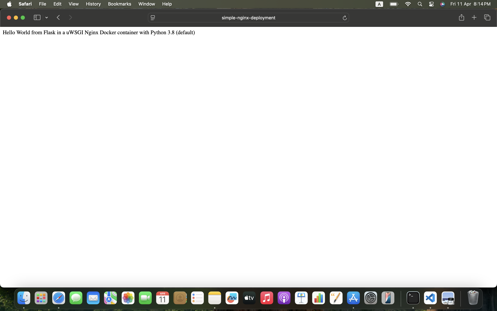

# k3-cluster


# Introduction

This project demonstrates setting up a lightweight Kubernetes (k3s) cluster using virtual machines. It includes one **server node**, one **agent node**, and a simple app deployment to verify the setup.

---

## Objective

- Install and configure a k3s cluster (1 server, 1 agent)
- Validate the cluster with `kubectl`
- Deploy a test app with 2 replicas
- Provide configurations files and screenshots for progress tracking


---

#  Prerequisites

Before you begin, please review the [installation requirements (https://docs.k3s.io/quick-start). 


---

## Quick Start

Follow these steps to get your Kubernetes cluster up and running:

### 1. Install k3s on the Server Node
Install k3s on the server node. This will set up your Kubernetes master:

```bash
curl -sfL https://get.k3s.io | INSTALL_K3S_EXEC="--token <Secret> --secrets-encryption" \ 
K3S_ARGS="--audit-log-path=/var/log/k3s/audit.log" sh -
```

| Argument               | Description                                                                                           |
|------------------------|-------------------------------------------------------------------------------------------------------|
| `--token`              | Specifies a secure token for authenticating communication between the server and agent nodes.          |
| `--secrets-encryption` | Enables encryption for Kubernetes secrets, enhancing security by protecting sensitive data.            |
| `--audit-log-path`     | Defines the location of the audit logs. These logs are essential for security monitoring and troubleshooting. |


### 2. Install k3s on the Agent Node
```
curl -sfL https://get.k3s.io | K3S_URL=https://<master-IP>:6443 K3S_TOKEN=<Secret> sh -
```

### 3. Verify cluster setup
On the master node, run the following command:

```
kubectl get nodes
````
The command kubectl get nodes is used to list all the nodes in your Kubernetes cluster. When you run this command, it provides details about each node in the cluster, such as its name, status, roles, age, and version. The output should like this:


### 4. Create a simple web app deployment
In this step, we will create a Kubernetes Deployment to deploy a simple Python web app with two replicas. The Manifests/python-deployment.yaml YAML configuration defines configuration defines the **Deployment** for the app.

#### Explanation:

- **apiVersion**: `apps/v1`  
  Specifies the API version for the Deployment.

- **kind**: `Deployment`  
  The type of Kubernetes resource being defined. A **Deployment** in Kubernetes is a resource used to manage a set of identical pods. It ensures that the specified number of pod replicas are running at all times and automatically handles the deployment and scaling of the application. With Deployments, you can also manage updates to your application, making it easy to roll out new versions while maintaining high availability.


- **metadata.name**: `python-web`  
  The name of the Deployment. Used to identify the resource.

- **spec.replicas**: `2`  
  Defines the number of pod replicas to run. Two replicas ensure high availability.

- **selector.matchLabels**: `app: python-web`  
  The label selector is used to identify the pods that belong to this

#### To run the deployment, run:
```
kubectl apply -f python-deployment.yaml
```
This will create a Deployment with two replicas of the Python web app, ensuring availability. The app will be running in the cluster, accessible on port 80 of each container in the pods.

### 5. Verify the Deployment
Once you have applied the Deployment, you can verify that your pods are running and that the Deployment was successful.

#### To check the status of the deployment:
```
kubectl get deployments
```
This will show the list of deployments in your cluster and their current status, including the number of pods that are up and running. For example, you should see something like:


### 6. Create configmap and nginx deployment
The config map will contain the needed configuration file that should be used by the nginx deployment. Hence, the configmap must be created before creating the nginx deployment

```
kubectl apply -f nginx-config.yaml
kubectl apply -f nginx-deployment.yaml
```

### 7. Verify the deployment
Nginx is exposed publicly via the node IP. To get the node IP:
```
kubectl get service
```
<table style="background-color: black; color: white; width: 100%; border-collapse: collapse;">
  <thead>
    <tr>
      <th style="color: #f4f4f4; padding: 8px; text-align: left;">NAME</th>
      <th style="color: #f4f4f4; padding: 8px; text-align: left;">TYPE</th>
      <th style="color: #f4f4f4; padding: 8px; text-align: left;">CLUSTER-IP</th>
      <th style="color: #f4f4f4; padding: 8px; text-align: left;">EXTERNAL-IP</th>
      <th style="color: #f4f4f4; padding: 8px; text-align: left;">PORT(S)</th>
      <th style="color: #f4f4f4; padding: 8px; text-align: left;">AGE</th>
    </tr>
  </thead>
  <tbody>
    <tr>
      <td style="padding: 8px; color: #b5b5b5;">kubernetes</td>
      <td style="padding: 8px; color: #b5b5b5;">ClusterIP</td>
      <td style="padding: 8px; color: #b5b5b5;">10.43.0.1</td>
      <td style="padding: 8px; color: #b5b5b5;">&lt;none&gt;</td>
      <td style="padding: 8px; color: #b5b5b5;">443/TCP</td>
      <td style="padding: 8px; color: #b5b5b5;">4h1m</td>
    </tr>
    <tr>
      <td style="padding: 8px; color: #b5b5b5;">nginx-service</td>
      <td style="padding: 8px; color: #b5b5b5;">NodePort</td>
      <td style="padding: 8px; color: #b5b5b5;">10.43.136.151</td>
      <td style="padding: 8px; color: #b5b5b5;">&lt;none&gt;</td>
      <td style="padding: 8px; color: #b5b5b5;">80:30080/TCP</td>
      <td style="padding: 8px; color: #b5b5b5;">28m</td>
    </tr>
    <tr>
      <td style="padding: 8px; color: #b5b5b5;">python-web-app-service</td>
      <td style="padding: 8px; color: #b5b5b5;">ClusterIP</td>
      <td style="padding: 8px; color: #b5b5b5;">10.43.68.22</td>
      <td style="padding: 8px; color: #b5b5b5;">&lt;none&gt;</td>
      <td style="padding: 8px; color: #b5b5b5;">80/TCP</td>
      <td style="padding: 8px; color: #b5b5b5;">28m</td>
    </tr>
  </tbody>
</table>

#### Explanation:
- The **`nginx-service`** is exposed using the **NodePort** type, making it accessible externally on port `30080`.
- The **`python-web-app-service`** is an internal service exposed via **ClusterIP**, meaning it’s only accessible within the cluster.
- The **`kubernetes`** service is the default cluster service.

You can access it via the web browser by adding an entry of the service IP with the corresponding domain in the host file. The output should appear as follows:



### 🔧 Troubleshooting
Here are some helpful commands to troubleshoot errors 

#### To view logs of k3 services
```
sudo journalctl -u k3s -f
# or for agent:
sudo journalctl -u k3s-agent -f
```

#### Check Node Status
```
kubectl get nodes
````
If nodes are NotReady, look at:
```
kubectl describe node <node-name>
```
#### Check Pod Status
```
kubectl get pods -A
```
Look for pods in CrashLoopBackOff, Pending, or Error states.
Then describe the pod:
```
kubectl describe pod <pod-name> -n <namespace>
# for specific container:
kubectl logs <pod-name> -c <container-name> -n <namespace>
```


