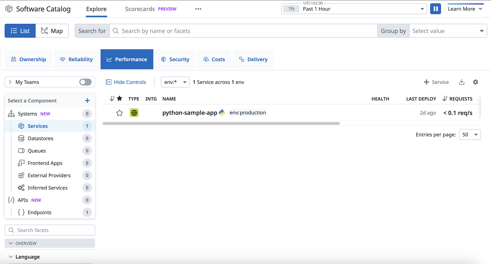

# Ansible K3s Setup and Monitoring

This project automates the deployment of a Kubernetes (k3s) cluster along with monitoring and observability tools using Ansible. It installs K3s, Istio, Prometheus, Grafana, and Datadog with proper configurations to manage and monitor your Kubernetes setup.


## Project Structure

The structure of the project is as follows:

### Explanation of the Directory Structure:

- **k3-cluster/**: The root directory of the project.
  - **ansible/**: Contains all Ansible-related files for automating the setup and configuration.
    - **k3s-ansible/**: This is a submodule that references the [`k3s-ansible`](https://github.com/k3s-io/k3s-ansible/) repository used to install and configure K3s.
    - **playbooks/**: Contains the Ansible playbook files.
      - **post-k3s-setup.yml**: This playbook is run after K3s installation to configure Istio, deploy the web app, and additional setup.
    - **inventory.yml**: The Ansible inventory file that defines the target servers for the setup, such as K3s server and agent nodes.
    - **group_vars/**:
      - **all.yml**  
        This file contains global variables that apply to all hosts in the Ansible inventory.  
        It serves as a central location to define values shared across multiple playbooks and roles.  
        Variables defined in `all.yml` include configurations such as Kubernetes settings, Helm chart versions, system parameters, and other general values.  
        These variables are automatically loaded by Ansible and can be referenced anywhere during playbook execution.
      - **/vault.yml**  
        This file securely stores sensitive information, such as API keys for services like **Datadog** and **ngrok**.  
        It is encrypted using **Ansible Vault**, which ensures that the sensitive data remains protected even if the repository is shared or stored publicly.  
        Ansible Vault encrypts the entire file, and it can only be decrypted using a password that you set when encrypting.  
        Vaulted variables can be accessed just like normal variables during playbook runs once the vault password is provided or configured.
    - **roles/**: This folder contains the roles referenced by the playbook `post-k3-setup.yml`.
      - **helm_setup/**: This role installs and configures Helm, the Kubernetes package manager, which is used to deploy Istio, Grafana, and other tools.
      - **istio_install/**: This role installs and configures Istio on the K3s cluster using Helm, including the setup of Istio's default configurations, gateway, and sidecar proxies.
      - **grafana_setup/**: This role installs and configures Grafana.
      - **deploy_helm/**: This role is responsible for deploying Kubernetes resources using Helm. It sets up various applications (e.g., Istio, Nginx, Python app) and observability tools (e.g., Datadog, Prometheus, Grafana) via Helm charts. This role includes the creation of necessary Helm values files (via templates) and their application to the Kubernetes cluster.
      - **prometheus_setup/**: This role sets up Prometheus for monitoring. It installs Prometheus via Helm, configures it to scrape metrics from Istio and other applications, and integrates it with Grafana for visualization. Additionally, it configures ngrok to expose the cluster gateway service via a public IP, making it accessible remotely in local or non-cloud environments.
      - **datadog_setup/**: This role configures Datadog for monitoring purposes by adding the Datadog Helm repository, updating Helm repos, and installing the Datadog agent.

- **k3s-ansible/**: Submodule for `k3s-ansible` repository used to install K3s.
- **playbooks/**: Playbook files to set up K3s, Istio, Grafana, Datadog, and other configurations.
- **inventory.yml**: Ansible inventory file, which specifies your target hosts (K3s server and agent).
- **roles/**: Directory containing the Ansible roles for various setup tasks (e.g., Helm, Grafana, Prometheus, Datadog).

<details>
  <summary>Inventory Configuration (`inventory.yml`)</summary>


#### Explanation of the Inventory Configuration


| Key                        | Description                                                                 |
|----------------------------|-----------------------------------------------------------------------------|
| `k3s_cluster`               | The main group containing your cluster.                                     |
| `server`                    | The group of server nodes. The server node is the master node of the K3s cluster. |
| `agent`                     | The group of agent nodes that will join the K3s cluster.                    |
| `ansible_port`              | The SSH port to connect to the nodes (default is `22`).                     |
| `ansible_user`              | The SSH user that Ansible will use to connect to the nodes. In this case, it is set to `ubuntu`. |
| `k3s_version`               | The version of K3s to install on the nodes. You can update it to the desired version. |
| `token`                     | The secret token used to join the agent nodes to the server node.           |
| `api_endpoint`              | The endpoint to access the K3s API server. It defaults to the first server node. |
| `extra_server_args`         | Extra arguments passed to the K3s server during installation, such as enabling secrets encryption and configuring audit logging. |

</details> 

<details>
  <summary>Group Variables Configuration (`group_vars/all.yml`)</summary>

#### Explanation of the Group Variables Configuration

- **k3s_namespace**: The Kubernetes namespace where Istio will be installed. The default is `istio-system`.
  
#### App Deployments

- **python_app**:
  - **name**: The name of the Python app deployment (e.g., `python-sample`).
  - **service_name**: The name of the Kubernetes service for the Python app (e.g., `python-app-service`).
  
- **nginx_app**:
  - **name**: The name of the Nginx load balancer app deployment (e.g., `nginx-load-balancer`).
  - **service_name**: The name of the Kubernetes service for the Nginx app (e.g., `nginx-service`).

#### Datadog Configuration


| Key                                                | Description                                                                 |
|-----------------------------------------------------|-----------------------------------------------------------------------------|
| `datadog.site`                                      | The Datadog site (e.g., `datadoghq.com` or `datadoghq.eu`).                |
| `datadog.clusterName`                               | The name of your Kubernetes cluster.                                        |
| `datadog.istio.enabled`                             | Set to `true` to enable Istio metrics collection.                           |
| `datadog.apm.enabled`                               | Set to `true` to enable APM (Application Performance Monitoring).           |
| `datadog.tags.env`                                  | Environment tag (e.g., `production`, `staging`).                            |
| `datadog.tags.team`                                 | Team tag for grouping (e.g., `devops`, `backend`).                          |
| `datadog.logs.enabled`                              | Set to `true` to enable log collection.                                     |
| `datadog.logs.container_collect_all`                | Set to `true` to collect logs from all containers.                          |
| `datadog.logs.container_collect_using_files`        | Set to `true` to collect logs using container log files.                    |
| `datadog.profiling_enabled`                         | Set to `"true"` to enable profiling for performance insights.               |
| `datadog.agent_image_name`                          | Datadog Agent container image name (e.g., `datadog/agent`).                 |
| `datadog.agent_image_tag`                           | Datadog Agent container image tag (e.g., `latest`).                         |


###  Istio Configuration

| Key                              | Description                                                                 |
|----------------------------------|-----------------------------------------------------------------------------|
| `istio.version`                  | The Istio version to install (e.g., `1.22.0`).                             |
| `istio.ingress_gateway.name`     | The name of the Istio ingress gateway (e.g., `istio-ingressgateway`).      |
| `istio.ingress_gateway.service.type` | The type of Kubernetes service for the ingress gateway (e.g., `NodePort`). |
| `istio.ingress_gateway.service.ports.port` | The port on which the ingress gateway will listen (e.g., `80`). |
| `istio.ingress_gateway.service.ports.targetPort` | The target port for the application (e.g., `80`). |
| `istio.ingress_gateway.service.ports.nodePort` | The NodePort for accessing the service (e.g., `30080`). |
| `istio.ingress_gateway.service.ports.name` | The name of the port (e.g., `http`). |

---

### Grafana Configuration

| Key                                 | Description                                                                 |
|-------------------------------------|-----------------------------------------------------------------------------|
| `grafana.service.type`              | The type of Kubernetes service for Grafana (e.g., `ClusterIP`).             |
| `grafana.service.port`              | The port for Grafana (e.g., `3000`).                                        |
| `grafana.service.url`               | The URL to access Grafana (e.g., `http://localhost/`).                      |
| `grafana.service.admin_password`    | The admin password for Grafana.                                             |

</details>


<details>
  <summary>Ansible vault (`ansible/group_vars/vault.yml`)</summary>

#### Datadog Configuration
| Key                       | Description                                                                 |
|---------------------------|-----------------------------------------------------------------------------|
| `datadog_keys.api_key`    | Datadog API KEY (replace with your actual key).                      |                
---

### Ngrok Configuration

| Key                       | Description                                                                 |
|---------------------------|-----------------------------------------------------------------------------|
| `ngrok.NGROK_AUTHTOKEN`    | Your Ngrok authtoken (replace with your actual token).                      |

</details>

<details>
  <summary>Helm Umbrella Chart Values (`ansible/helm_deployment/values.yml`)</summary>

### Global Configuration

The `global` section defines shared values accessible by all subcharts. These are commonly used for namespaces, port configurations, and service labels.

### Kubernetes Configuration

| Key                            | Description                                                                 |
|--------------------------------|-----------------------------------------------------------------------------|
| `namespace`                    | Kubernetes namespace where all components will be deployed.                |
|                                | **(Overridden from `all.yml`: `k3s_namespace` using `--set global.namespace`)** |
| `port.python_app_port`         | Port exposed by the Python app.                                             |
| `port.nginx_load_balancer`     | Port exposed by the Nginx load balancer.                                   |
| `label.python_app_service`     | Service name for the Python app.                                           |
|                                | **(Overridden from `all.yml`: `python_app.service_name` using `--set global.label.python_app_service`)** |
| `label.nginx_load_balancer`    | Service name for the Nginx app.                                            |
|                                | **(Overridden from `all.yml`: `nginx_app.service_name` using `--set global.label.nginx_load_balancer`)** |
| `istio.istio_gateway`          | Name of the Istio ingress gateway.                                         |
|                                | **(Overridden from `all.yml`: `istio.ingress_gateway.name` using `--set global.istio_gateway`)** |
| `istio.port`                   | Port used by the Istio ingress gateway.                                    |
|                                | **(Overridden from `all.yml`: `istio.ingress_gateway.service.ports[0].port` using `--set global.istio.port`)** |

---

### Python App Configuration (`sample-python-app`)

This section corresponds to the `sample-python-app` Helm **subchart** and includes values specific to the deployment of the sample Python application.

| Key                         | Description                                                                 |
|-----------------------------|-----------------------------------------------------------------------------|
| `label.app`                  | Label used to identify the Python app.                                      |
| `replicaCount`               | Number of replicas for the app.                                             |
| `image`                      | Docker image configuration.                                                 |
| `env`                        | Environment variables for Datadog integration and app metadata.             |
| `service`                    | Service type and protocol.                                                  |

---

### Nginx Load Balancer Configuration (`nginx-load-balancer`)

This section belongs to the `nginx-load-balancer` Helm **subchart**, responsible for deploying your Nginx reverse proxy.

| Key                         | Description                                                                 |
|-----------------------------|-----------------------------------------------------------------------------|
| `label.app`                  | Label for Nginx.                                                            |
| `replicaCount`               | Number of replicas.                                                         |
| `image`                      | Docker image configuration.                                                 |
| `service`                    | Service protocol and type.                                                  |

---

### Istio Gateway Configuration (`istio-deployment`)

This section configures the `istio-deployment` Helm **subchart**, which manages Istio resources like gateways and virtual services.

| Key                         | Description                                                                 |
|-----------------------------|-----------------------------------------------------------------------------|
| `service`                    | Protocol setup and allowed hosts.                                           |
| `gateway_name`               | Custom gateway name.                                                        |
| `grafana`                    | Internal access settings for Grafana.                                       |
| `prefix`                     | URL path prefixes for routes.                                               |

---

### Ngrok Tunnel Configuration (`ngrok`)

This section is used by the `ngrok` Helm **subchart** to expose services to the public internet.

| Key                        | Description                                                                 |
|----------------------------|-----------------------------------------------------------------------------|
| `authToken`                | Ngrok authentication token.                                                |
|                            | **(Overridden from `all.yml`: `ngrok.NGROK_AUTHTOKEN` using `--set ngrok.authToken`)** |
| `secret_name`              | Kubernetes secret name.                                                     |
| `deployment.label.app`     | Label for the ngrok deployment.                                             |
| `deployment.replicaCount`  | Number of ngrok agent replicas.                                            |
| `deployment.image`         | Docker image for the ngrok agent.                                           |

</details>


## Prerequisites

Before running the playbooks, ensure that you have the following prerequisites:

- Ansible 2.9+ installed on your local machine or control node.
- A working SSH connection to your target servers (the K3s server and agent nodes).
- Customize `inventory.yml` and `group_vars/all.yml` with values specific to your environment.
- Replace `group_vars/vault.yml` with specific values for API Keys using the command below:
```bash
ansible-vault create group_vars/vault.yml
## You'll be promted to add password
## After creating the file make sure to add the values in this format:
# ==== Datadog ====
datadog_keys:
  api_key: "test"
# ==== Ngrok ====
ngrok:
  NGROK_AUTHTOKEN: "test"
```
- Initialize and update the k3s-ansible submodule using the commands below:
```
git submodule init
git submodule update
```

## Running the Playbooks

To set up the K3s cluster and deploy the observability tools, you can use the following commands:

### 1. Run the K3s Installation Playbook

The first step is to install K3s on the server and agent nodes. Run the following playbook to set up the K3s cluster:

```bash
cd ansible/k3s-ansible
ansible-playbook -i ../inventory.yml playbooks/site.yml
```
This will:

- Install K3s on the server and agent nodes.
- Deploy Istio, Grafana, Prometheus, and Datadog.
- Apply Kubernetes manifests for your applications.

## 2. Verify the Cluster

After the playbook runs successfully, verify the K3s cluster and deployed applications with kubectl:

```bash
kubectl get nodes
```
The command kubectl get nodes is used to list all the nodes in your Kubernetes cluster. When you run this command, it provides details about each node in the cluster, such as its name, status, roles, age, and version. The output should like this:


## 3. Run the post-setup ansible playbook
After installing k3s and starting your own cluster. Run the post-setup playbook for the rest of the project deployments:

```bash
cd ansible
ansible-playbook -i inventory.yml playbooks/post-k3-setup.yml --ask-vault-pass
```

## 4. Verify deployment

```
kubectl get service -n istio-system
```
<table style="background-color: black; color: white; width: 100%; border-collapse: collapse;">
  <thead>
    <tr>
      <th style="color: #f4f4f4; padding: 8px; text-align: left;">NAME</th>
      <th style="color: #f4f4f4; padding: 8px; text-align: left;">TYPE</th>
      <th style="color: #f4f4f4; padding: 8px; text-align: left;">CLUSTER-IP</th>
      <th style="color: #f4f4f4; padding: 8px; text-align: left;">EXTERNAL-IP</th>
      <th style="color: #f4f4f4; padding: 8px; text-align: left;">PORT(S)</th>
      <th style="color: #f4f4f4; padding: 8px; text-align: left;">AGE</th>
    </tr>
  </thead>
  <tbody>
    <tr>
      <td style="padding: 8px; color: #b5b5b5;">datadog</td>
      <td style="padding: 8px; color: #b5b5b5;">ClusterIP</td>
      <td style="padding: 8px; color: #b5b5b5;">10.43.85.68</td>
      <td style="padding: 8px; color: #b5b5b5;">&lt;none&gt;</td>
      <td style="padding: 8px; color: #b5b5b5;">8125/UDP,8126/TCP</td>
      <td style="padding: 8px; color: #b5b5b5;">58m</td>
    </tr>
    <tr>
      <td style="padding: 8px; color: #b5b5b5;">datadog-cluster-agent</td>
      <td style="padding: 8px; color: #b5b5b5;">ClusterIP</td>
      <td style="padding: 8px; color: #b5b5b5;">10.43.71.174</td>
      <td style="padding: 8px; color: #b5b5b5;">&lt;none&gt;</td>
      <td style="padding: 8px; color: #b5b5b5;">5005/TCP</td>
      <td style="padding: 8px; color: #b5b5b5;">58m</td>
    </tr>
    <tr>
      <td style="padding: 8px; color: #b5b5b5;">datadog-cluster-agent-admission-controller</td>
      <td style="padding: 8px; color: #b5b5b5;">ClusterIP</td>
      <td style="padding: 8px; color: #b5b5b5;">10.43.204.141</td>
      <td style="padding: 8px; color: #b5b5b5;">&lt;none&gt;</td>
      <td style="padding: 8px; color: #b5b5b5;">443/TCP</td>
      <td style="padding: 8px; color: #b5b5b5;">58m</td>
    </tr>
    <tr>
      <td style="padding: 8px; color: #b5b5b5;">grafana</td>
      <td style="padding: 8px; color: #b5b5b5;">ClusterIP</td>
      <td style="padding: 8px; color: #b5b5b5;">10.43.175.14</td>
      <td style="padding: 8px; color: #b5b5b5;">&lt;none&gt;</td>
      <td style="padding: 8px; color: #b5b5b5;">3000/TCP</td>
      <td style="padding: 8px; color: #b5b5b5;">4h59m</td>
    </tr>
    <tr>
      <td style="padding: 8px; color: #b5b5b5;">istio-ingressgateway</td>
      <td style="padding: 8px; color: #b5b5b5;">NodePort</td>
      <td style="padding: 8px; color: #b5b5b5;">10.43.126.55</td>
      <td style="padding: 8px; color: #b5b5b5;">&lt;none&gt;</td>
      <td style="padding: 8px; color: #b5b5b5;">80:30080/TCP</td>
      <td style="padding: 8px; color: #b5b5b5;">4h59m</td>
    </tr>
    <tr>
      <td style="padding: 8px; color: #b5b5b5;">istiod</td>
      <td style="padding: 8px; color: #b5b5b5;">ClusterIP</td>
      <td style="padding: 8px; color: #b5b5b5;">10.43.122.55</td>
      <td style="padding: 8px; color: #b5b5b5;">&lt;none&gt;</td>
      <td style="padding: 8px; color: #b5b5b5;">15010/TCP,15012/TCP,443/TCP,15014/TCP</td>
      <td style="padding: 8px; color: #b5b5b5;">4h59m</td>
    </tr>
    <tr>
      <td style="padding: 8px; color: #b5b5b5;">nginx-service</td>
      <td style="padding: 8px; color: #b5b5b5;">ClusterIP</td>
      <td style="padding: 8px; color: #b5b5b5;">10.43.113.149</td>
      <td style="padding: 8px; color: #b5b5b5;">&lt;none&gt;</td>
      <td style="padding: 8px; color: #b5b5b5;">80/TCP</td>
      <td style="padding: 8px; color: #b5b5b5;">58m</td>
    </tr>
    <tr>
      <td style="padding: 8px; color: #b5b5b5;">prometheus</td>
      <td style="padding: 8px; color: #b5b5b5;">ClusterIP</td>
      <td style="padding: 8px; color: #b5b5b5;">10.43.247.38</td>
      <td style="padding: 8px; color: #b5b5b5;">&lt;none&gt;</td>
      <td style="padding: 8px; color: #b5b5b5;">9090/TCP</td>
      <td style="padding: 8px; color: #b5b5b5;">35m</td>
    </tr>
    <tr>
      <td style="padding: 8px; color: #b5b5b5;">python-app-service</td>
      <td style="padding: 8px; color: #b5b5b5;">ClusterIP</td>
      <td style="padding: 8px; color: #b5b5b5;">10.43.62.80</td>
      <td style="padding: 8px; color: #b5b5b5;">&lt;none&gt;</td>
      <td style="padding: 8px; color: #b5b5b5;">80/TCP</td>
      <td style="padding: 8px; color: #b5b5b5;">58m</td>
    </tr>
  </tbody>
</table>


#### To access the web app:
In any browser access the web app through:
`http://<server-ip>:30080/nginx`
or via the ngrok URL


#### Access Grafana
Grafana will be available at `http://<server-ip>:30080`. Log in using the credentials defined in your playbook (`admin/admin` by default) and access the pre-configured dashboards.

#### Datadog Integration
### Verify Datadog Integration

1. **Access the Datadog Dashboard**  
   Go to your [Datadog dashboard](https://app.datadoghq.com).

2. **Check APM Data**  
   Navigate to the **APM** section to see application traces and ensure the app agent is sending data. The data should like like this:
   

3. **Check Infrastructure**  
   Go to the **Infrastructure** section to view Kubernetes metrics like CPU, memory usage, and pod performance. It should look like this:
   


## Additional Notes

### Ngrok Setup
To expose the cluster publicly, you need to configure Ngrok. First, sign up for a free Ngrok account at [https://ngrok.com/](https://ngrok.com/). Once you have an account, retrieve your authtoken from the Ngrok dashboard and add it to the `ngrok_token` variable in `all.yml`.

## Datadog API Key
* To integrate Datadog with your Kubernetes setup, you'll need your Datadog API key. You can get it from the Datadog dashboard.
* Add the API key to your all.yml for the [`Datadog agent setup`](https://app.datadoghq.com/account/settings#api).


