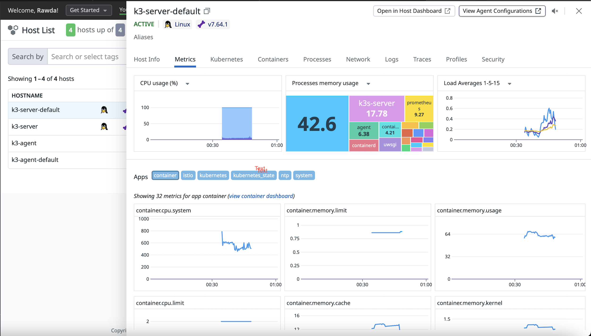

# Ansible K3s Setup and Monitoring

This project automates the deployment of a Kubernetes (k3s) cluster along with monitoring and observability tools using Ansible. It installs K3s, Istio, Prometheus, Grafana, and Datadog with proper configurations to manage and monitor your Kubernetes setup.

## Prerequisites

Before running the playbooks, ensure that you have the following prerequisites:

- Ansible 2.9+ installed on your local machine or control node.
- A working SSH connection to your target servers (the K3s server and agent nodes).
- Access to the Kubernetes cluster and `kubectl` installed.


## Project Structure

The structure of the project is as follows:

### Explanation of the Directory Structure:

- **k3-cluster/**: The root directory of the project.
  - **ansible/**: Contains all Ansible-related files for automating the setup and configuration.
    - **k3s-ansible/**: This is a submodule that references the [`k3s-ansible`](https://github.com/k3s-io/k3s-ansible/) repository used to install and configure K3s.
    - **playbooks/**: Contains the Ansible playbook files.
      - **post-k3s-setup.yml**: This playbook is run after K3s installation to configure Istio, deploy the web app, and additional setup.
    - **inventory.yml**: The Ansible inventory file that defines the target servers for the setup, such as K3s server and agent nodes.
    - **roles/**: This folder contains the roles referenced by the playbook `post-k3-setup.yml`.
      - **helm_setup/**: This role installs and configures Helm, the Kubernetes package manager, which is used to deploy Istio, Grafana, and other tools.
      - **istio_install/**: This role installs and configures Istio on the K3s cluster using Helm, including the setup of Istio's default configurations, gateway, and sidecar proxies.
      - **grafana_setup/**: This role installs and configures Grafana.
      - **deploy_manifests/**: This role copies Kubernetes manifests to the nodes and applies them using kubectl. It deploys applications, services, and resources like Istio ingress gateway, Nginx, and the Python app.
      - **prometheus_setup/**: This role sets up Prometheus by applying the necessary YAML files for monitoring and integrates it with Grafana.
      - **datadog_setup/**: This role configures Datadog for monitoring purposes by adding the Datadog Helm repository, updating Helm repos, and installing the Datadog agent.

- **k3s-ansible/**: Submodule for `k3s-ansible` repository used to install K3s.
- **playbooks/**: Playbook files to set up K3s, Istio, Grafana, Datadog, and other configurations.
- **inventory.yml**: Ansible inventory file, which specifies your target hosts (K3s server and agent).
- **roles/**: Directory containing the Ansible roles for various setup tasks (e.g., Helm, Grafana, Prometheus, Datadog).


### Inventory Configuration (`inventory.yml`)

#### Explanation of the Inventory Configuration

- **k3s_cluster**: The main group containing your cluster.
- **server**: The group of server nodes. The server node is the master node of the K3s cluster.
- **agent**: The group of agent nodes that will join the K3s cluster.
- **ansible_port**: The SSH port to connect to the nodes (default is `22`).
- **ansible_user**: The SSH user that Ansible will use to connect to the nodes. In this case, it is set to `ubuntu`.
- **k3s_version**: The version of K3s to install on the nodes. You can update it to the desired version.
- **token**: The secret token used to join the agent nodes to the server node.
- **api_endpoint**: The endpoint to access the K3s API server. It defaults to the first server node.
- **extra_server_args**: Extra arguments passed to the K3s server during installation, such as enabling secrets encryption and configuring audit logging.


## Running the Playbooks

To set up the K3s cluster and deploy the observability tools, you can use the following commands:

### 1. Run the K3s Installation Playbook

The first step is to install K3s on the server and agent nodes. Run the following playbook to set up the K3s cluster:

```bash
cd ansible/k3s-ansible
ansible-playbook -i ../inventory.yml playbooks/site.yml
```
This will:

- Install K3s on the server and agent nodes.
- Deploy Istio, Grafana, Prometheus, and Datadog.
- Apply Kubernetes manifests for your applications.

## 2. Verify the Cluster

After the playbook runs successfully, verify the K3s cluster and deployed applications with kubectl:

```bash
kubectl get nodes
```
The command kubectl get nodes is used to list all the nodes in your Kubernetes cluster. When you run this command, it provides details about each node in the cluster, such as its name, status, roles, age, and version. The output should like this:


## 3. Run the post-setup ansible playbook
After installing k3s and starting your own cluster. Run the post-setup playbook for the rest of the project deployments:

```bash
cd ansible
ansible-playbook -i inventory.yml playbooks/post-k3-setup.yml
```

## 4. Verify deployment

```
kubectl get service -n istio-system
```
<table style="background-color: black; color: white; width: 100%; border-collapse: collapse;">
  <thead>
    <tr>
      <th style="color: #f4f4f4; padding: 8px; text-align: left;">NAME</th>
      <th style="color: #f4f4f4; padding: 8px; text-align: left;">TYPE</th>
      <th style="color: #f4f4f4; padding: 8px; text-align: left;">CLUSTER-IP</th>
      <th style="color: #f4f4f4; padding: 8px; text-align: left;">EXTERNAL-IP</th>
      <th style="color: #f4f4f4; padding: 8px; text-align: left;">PORT(S)</th>
      <th style="color: #f4f4f4; padding: 8px; text-align: left;">AGE</th>
    </tr>
  </thead>
  <tbody>
    <tr>
      <td style="padding: 8px; color: #b5b5b5;">datadog</td>
      <td style="padding: 8px; color: #b5b5b5;">ClusterIP</td>
      <td style="padding: 8px; color: #b5b5b5;">10.43.151.15</td>
      <td style="padding: 8px; color: #b5b5b5;">&lt;none&gt;</td>
      <td style="padding: 8px; color: #b5b5b5;">8125/UDP,8126/TCP</td>
      <td style="padding: 8px; color: #b5b5b5;">145m</td>
    </tr>
    <tr>
      <td style="padding: 8px; color: #b5b5b5;">datadog-cluster-agent</td>
      <td style="padding: 8px; color: #b5b5b5;">ClusterIP</td>
      <td style="padding: 8px; color: #b5b5b5;">10.43.166.25</td>
      <td style="padding: 8px; color: #b5b5b5;">&lt;none&gt;</td>
      <td style="padding: 8px; color: #b5b5b5;">5005/TCP</td>
      <td style="padding: 8px; color: #b5b5b5;">145m</td>
    </tr>
    <tr>
      <td style="padding: 8px; color: #b5b5b5;">datadog-cluster-agent-admission-controller</td>
      <td style="padding: 8px; color: #b5b5b5;">ClusterIP</td>
      <td style="padding: 8px; color: #b5b5b5;">10.43.131.149</td>
      <td style="padding: 8px; color: #b5b5b5;">&lt;none&gt;</td>
      <td style="padding: 8px; color: #b5b5b5;">443/TCP</td>
      <td style="padding: 8px; color: #b5b5b5;">145m</td>
    </tr>
    <tr>
      <td style="padding: 8px; color: #b5b5b5;">grafana</td>
      <td style="padding: 8px; color: #b5b5b5;">ClusterIP</td>
      <td style="padding: 8px; color: #b5b5b5;">10.43.5.138</td>
      <td style="padding: 8px; color: #b5b5b5;">&lt;none&gt;</td>
      <td style="padding: 8px; color: #b5b5b5;">3000/TCP</td>
      <td style="padding: 8px; color: #b5b5b5;">155m</td>
    </tr>
    <tr>
      <td style="padding: 8px; color: #b5b5b5;">istio-ingressgateway</td>
      <td style="padding: 8px; color: #b5b5b5;">NodePort</td>
      <td style="padding: 8px; color: #b5b5b5;">10.43.102.133</td>
      <td style="padding: 8px; color: #b5b5b5;">&lt;none&gt;</td>
      <td style="padding: 8px; color: #b5b5b5;">80:30080/TCP,443:30443/TCP</td>
      <td style="padding: 8px; color: #b5b5b5;">3h3m</td>
    </tr>
    <tr>
      <td style="padding: 8px; color: #b5b5b5;">istiod</td>
      <td style="padding: 8px; color: #b5b5b5;">ClusterIP</td>
      <td style="padding: 8px; color: #b5b5b5;">10.43.227.169</td>
      <td style="padding: 8px; color: #b5b5b5;">&lt;none&gt;</td>
      <td style="padding: 8px; color: #b5b5b5;">15010/TCP,15012/TCP,443/TCP,15014/TCP</td>
      <td style="padding: 8px; color: #b5b5b5;">3h8m</td>
    </tr>
    <tr>
      <td style="padding: 8px; color: #b5b5b5;">nginx-service</td>
      <td style="padding: 8px; color: #b5b5b5;">NodePort</td>
      <td style="padding: 8px; color: #b5b5b5;">10.43.208.94</td>
      <td style="padding: 8px; color: #b5b5b5;">&lt;none&gt;</td>
      <td style="padding: 8px; color: #b5b5b5;">80:30090/TCP</td>
      <td style="padding: 8px; color: #b5b5b5;">153m</td>
    </tr>
    <tr>
      <td style="padding: 8px; color: #b5b5b5;">prometheus</td>
      <td style="padding: 8px; color: #b5b5b5;">ClusterIP</td>
      <td style="padding: 8px; color: #b5b5b5;">10.43.54.180</td>
      <td style="padding: 8px; color: #b5b5b5;">&lt;none&gt;</td>
      <td style="padding: 8px; color: #b5b5b5;">9090/TCP</td>
      <td style="padding: 8px; color: #b5b5b5;">145m</td>
    </tr>
    <tr>
      <td style="padding: 8px; color: #b5b5b5;">python-sample-app-service</td>
      <td style="padding: 8px; color: #b5b5b5;">ClusterIP</td>
      <td style="padding: 8px; color: #b5b5b5;">10.43.53.141</td>
      <td style="padding: 8px; color: #b5b5b5;">&lt;none&gt;</td>
      <td style="padding: 8px; color: #b5b5b5;">80/TCP</td>
      <td style="padding: 8px; color: #b5b5b5;">153m</td>
    </tr>
  </tbody>
</table>

#### To access the web app:
In any browser access the web app through:
`http://<server-ip>:30080/nginx`


#### Access Grafana
Grafana will be available at `http://<server-ip>:30080`. Log in using the credentials defined in your playbook (`admin/admin` by default) and access the pre-configured dashboards.

#### Datadog Integration
### Verify Datadog Integration

1. **Access the Datadog Dashboard**  
   Go to your [Datadog dashboard](https://app.datadoghq.com).

2. **Check APM Data**  
   Navigate to the **APM** section to see application traces and ensure the app agent is sending data. The data should like like this:
   

3. **Check Infrastructure**  
   Go to the **Infrastructure** section to view Kubernetes metrics like CPU, memory usage, and pod performance. It should look like this:
   


## Additional Notes

- **Customizing Values**: You can modify the values in the YAML files under `ansible/roles` to customize deployments for your environment, such as changing the Grafana dashboard or adjusting Istio configurations.
- **Scaling**: If you want to scale your K3s cluster, simply add more agent nodes to the inventory and rerun the playbook to join them to the cluster.


